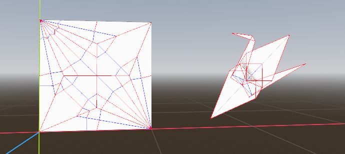

# FOLD plugin for Godot 4

This codebase builds upon an existing work. 
All example files are produced by the software below. 

1. FOLD file format for origami models, crease patterns, etc. 
https://github.com/edemaine/fold

2. Rabbit Ear library for modeling origami. 
https://github.com/rabbit-ear/rabbit-ear

3. Realtime WebGL origami simulator. 
https://github.com/amandaghassaei/OrigamiSimulator

## Design goals
* 3D editor with 2D crease pattern drawing and key framing.
* Rigid origami solver for displaying a smooth folding process.
* Web viewer for the precomputed animation and VFX export.

## Current features
* Triangulation of SVG crease patterns into meshes.
* Software agnostic encoding of a colorful wireframes.
