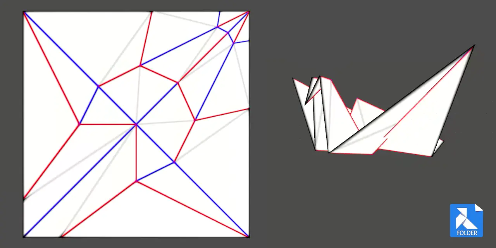

# Origami folding plugin for Godot 4
 
Folder plugin provides a way to work with FOLD (Flexible Origami List Datastructure). 
Draw crease patterns and simulate them, freeze the intermediate results as key frames. 
Export precomputed folding animation as an easy to parse series of meshes. 

## Inspiration
This codebase builds upon an existing work. 
All example files are produced by the software below. 

1. FOLD file format for origami models, crease patterns, etc. 
https://github.com/edemaine/fold/blob/main/doc/spec.md

2. Realtime WebGL origami simulator. 
https://github.com/amandaghassaei/OrigamiSimulator

3. Rabbit Ear library for modeling origami. 
https://github.com/rabbit-ear/rabbit-ear

## Design goals
* Create a practical tool for encoding digital origami instructions. 
* Synchronized 3D editor with 2D crease pattern view and a timeline.
* Attempt to solve Z-fighting of a flat folded paper with [stencil decaling](https://www.opengl.org/archives/resources/code/samples/advanced/advanced97/notes/node198.html).
* Web viewer for the precomputed animation and a cross-software export.

## Current features
* FOLD specification (version 1.2) validation.
* Triangulation of SVG crease patterns into meshes.
* Software agnostic encoding of a colorful wireframes.
* GPU accelerated origami simulation with a CPU fallback.
